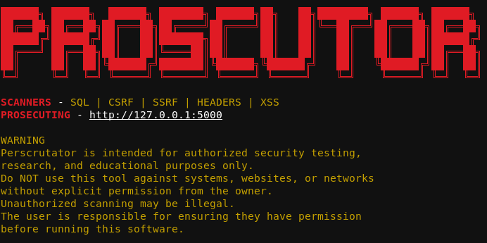

# PROSECUTOR


prosecutor is a modular web security scanner written in Python.

It is designed to discover web application attack surfaces, analyze inputs, and run security checks through dynamically loaded scanner modules.

The project uses an addon-based architecture, allowing new scanners to be added without modifying the core engine.
<div align="center">
  
</div>

---

## Features
- Strong core architecture built around a modular extension system
- Add new security scanners without modifying the main engine
- Dynamic loading of scanner modules
- Independent scanner development and testing
- Domain crawler mode for automated endpoint discovery and attack surface mapping
---
## Vulnerability Modules

### SQL Injection (SQLi)
- Injects SQL payloads into discovered parameters
- Tests application responses for potential database manipulation
- Supports customizable payload sets

### Cross-Site Request Forgery (CSRF)
- Analyzes forms and request actions
- Generates CSRF test cases against state-changing requests
- Checks for missing anti-CSRF protections

### Server-Side Request Forgery (SSRF)
- Injects URL-based payloads into potential SSRF parameters
- Tests server-side request behavior using ngrok
- Supports out-of-band callback verification

### Cross-Site Scripting (XSS)
- Injects XSS payloads into user-controlled inputs
- Tests reflected and stored input points
- Analyzes responses for possible script execution

### Security Headers
- Inspects HTTP response headers
- Detects missing or insecure security configurations
- Reports recommended header policies
---
##  Installation

Clone the repository:

```bash
git clone https://github.com/loucifer-x/PROSECUTOR.git
cd PROSECUTOR
```

Install the dependencies:

```bash
pip install -r requirements.txt
```

Install the Playwright browser binaries:

```bash
playwright install
```

## Prerequisites

This project(SSRF SCANNER) requires an **ngrok** tunnel for features that rely on receiving HTTP callbacks.

1. Download and install **ngrok**.
2. Authenticate your ngrok client with your account.
3. Start a tunnel to your local listener (replace `<PORT>` with the port your application uses):

```bash
ngrok http <PORT>
```

4. Copy the generated public URL and configure the application to use it.

## Running

```bash
python main.py
```

---
##  Disclaimer

Perscrutator is intended for **authorized security testing, education, and research purposes only**.

Do **not** use this tool against websites, applications, servers, or networks that you do not own or do not have explicit permission to test.

Unauthorized security testing may be illegal.

The user is solely responsible for ensuring they have proper authorization before running this software. The author assumes no responsibility for misuse or damage caused by this tool.

Recommended testing environments:

- Your own applications
- Local development environments
- Capture The Flag (CTF) challenges
- Intentionally vulnerable applications

---


